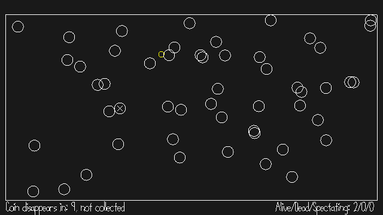

# Amidst Ourselves

Author: Lawrence Chen

Design: In this game, you must try to simultaneously fit in with the NPCs, collect coins, and find out who else is a real player and kill them.

Networking: The client sends only the controls over to the server. This means which buttons are pressed and the down count of each button. The server periodically sends the client the new game state, which consists of all the player positions, who is alive/dead, the npc positions, and the coin position. Each client draws the game state using the most recent values received.

Screen Shot:

How To Play:

WASD to move
Spacebar to dash briefly in the direction of movement (5s cooldown)
R to restart (can be done by any player)

The goal of the game is to kill other players by dashing through them and be the last one standing. However, this is not straightforward as there are 30 NPCs also walking around that look exactly the same as the players. Dashing exposes your own position to other players, so spamming it is probably a bad idea.

The game alternates between two phases: coin phase and break phase. During coin phase, there is a coin that spawns randomly somewhere in the arena and each player must individually touch it to collect it. When coin phase ends, players that have not yet touched the coin will be highlighted in red for two seconds, making them easy targets.

Thus, the main strategy is to move in a way similar to the NPCs. When a coin spawns, you should collect it inconspicuously to avoid drawing attention. Meanwhile, you have to pay attention to the other circles to decide which ones are real players.

Sources: reused some default assets (circles and rectangular arena)

This game was built with [NEST](NEST.md).

